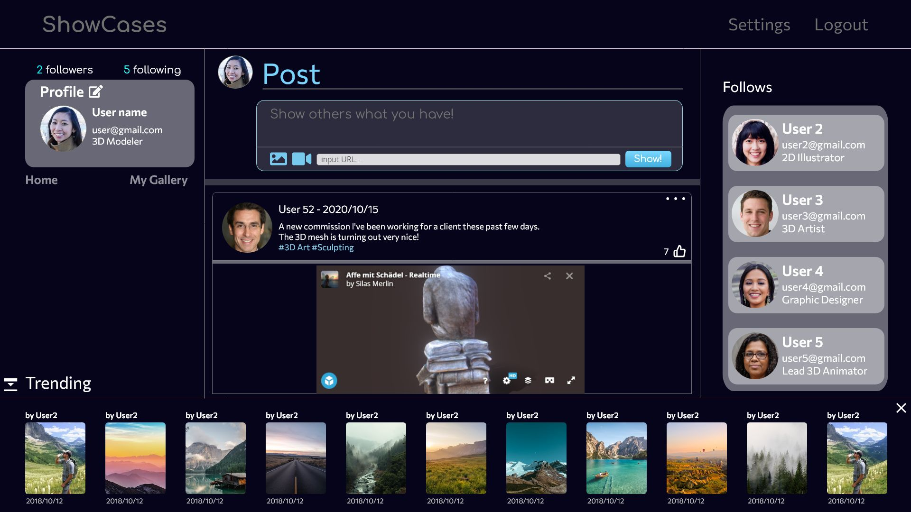
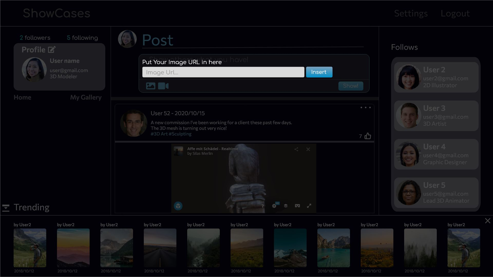
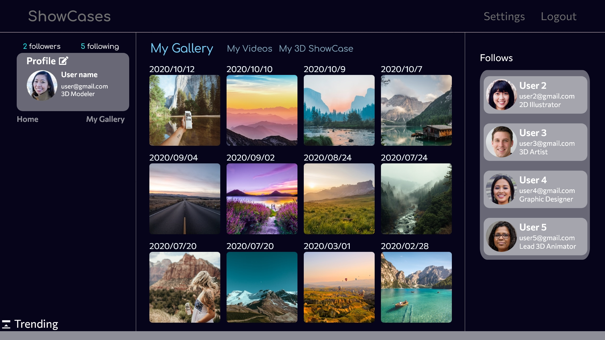
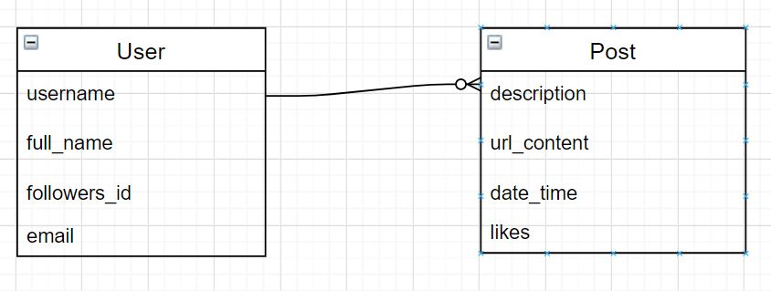

# ShowCases
A media sharing focused social platform

## Wireframe
Home page after signing in. Register/Login process is required before entering.

When adding new post, user can put in URL of their 3rd party uploaded photos. Only 1 url is permitted for 1 post. (subject to change)

User gallery. Current user can view others' gallery but without the authorization to edit

## ERD

## User Story
The user will enter a social media platform where they can follow and like the other's user posts.  
The platform allow what posts are trending and the user can have custom and organize their gallery inside their profile.  

## MVP Pitch
The MVP will contain a model for the user (with full authorization) and the posts. Each user can have many posts, and each post can contain text content and either an image, video URL or sketchfab URL to share their art/video URL from their other favorite platform.  

The user can:  
    1. edit their profile (email address, individual posts).  
    2. follow other artists (have their own follow sidebar).  
    3. read other artists' posts and their gallery.  
    4. go to their own gallery (which are their posts) and edit/delete them. 
    5. see the number and see the followers and following other users.  

The app can:
    1. allow user to close trending panel, which shows most liked posts in descending order. 

## Milestone:
Week 1: NodeJS/Express/Mongoose based application  
- Monday-Tuesday: Building basic framework and models.  
- Tuesday-Wednesday: Full CRUD for user's posts and authorization route  
- Thursday-Friday: Implement core features that user can follow and like posts  
- Weekend: Finishing front-end feature designs and styles.  

Week 2: React as frontend with NodeJS/Mongoose as backend API 
- Monday: Implement React refactor by refactoring Node into API  
- Tuesday-Wednesday: Finish React refactoring and optimizing codes  

## Stretch Goals:
- The image can be uploaded to the user's model  
